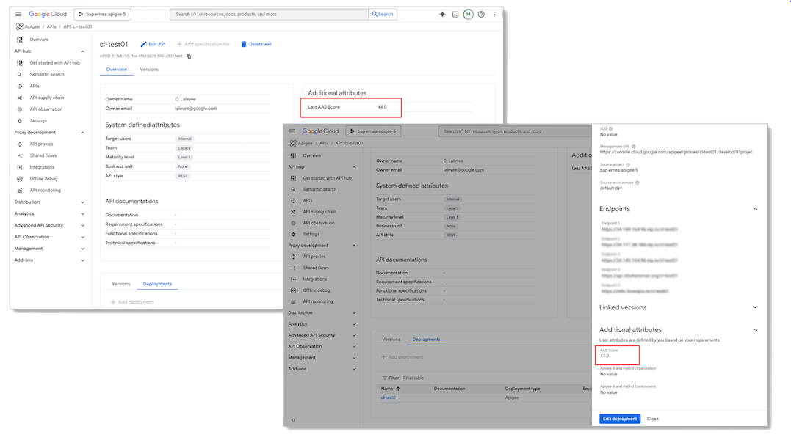
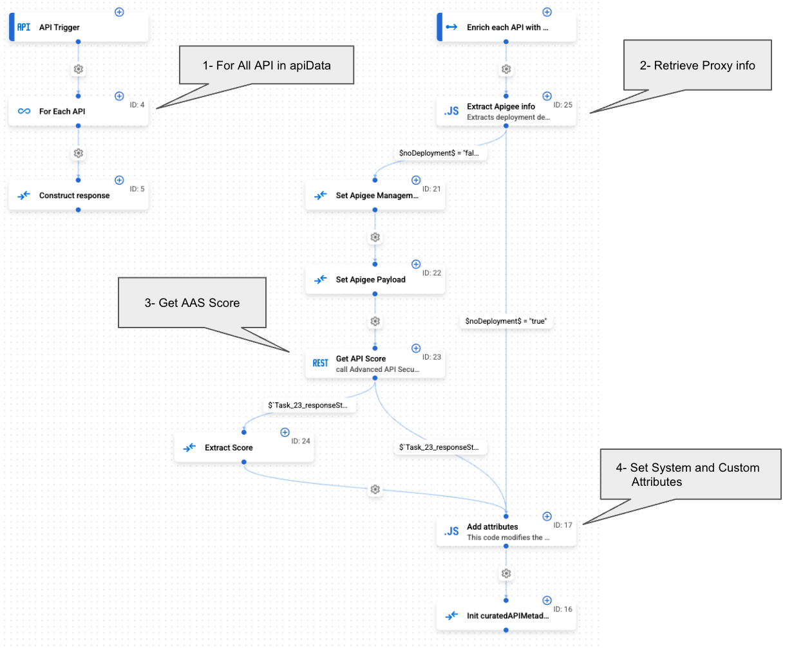

# Custom Curation for Apigee API hub: <BR>Integrating Advanced API Security, Security Score


**This is not an official Google product.**<BR>This implementation is not an official Google product, nor is it part of an official Google product. Support is available on a best-effort basis via GitHub.


---

## Overview

This repository provides a concrete example of a custom **API Hub Curation** process, built using **Google Application Integration**. This process specifically ingests API metadata from Apigee [Advanced API Security](https://cloud.google.com/apigee/docs/api-security) (AAS), Risk Asessment. [Advanced API Security risk assessment](https://cloud.google.com/apigee/docs/api-security/security-scores) continuously evaluates API proxy configurations and calculates security scores to help identify and address vulnerabilities in your APIs.

This API Hub Curation enriches API metadata ingested by Apigee API Hub plugins with the Security Score dynamically calculated by AAS. For a comprehensive overview, refer to the [Apigee API hub Curation documentation](https://cloud.google.com/apigee/docs/apihub/curations).

The curation logic implemented here performs the following steps for each ingested API:

* **Calculate the ASS Score:** 
  
  It calls the Apigee Advanced API Security API to get the security score.
* **Initialize API hub custom attributes:** 

  The AAS Security Score is stored in two different custom attributes:
    - `aas-score`: This attribute stores the Security Score at API version deployment level
    - `last-aas-score`: This attribute stores the last Security Score calculated at API level.


<p align="center">

</p>


### Application Integration Overview


<P>

</p>

## Prerequisites

To implement this sample, you'll need a GCP account with both Apigee API hub and Application Integration activated. If needed refer to Google Documentation [Provision API hub](https://cloud.google.com/apigee/docs/apihub/provision) and [Set up Application Integration](https://cloud.google.com/application-integration/docs/setup-application-integration).

You'll also need access to an Apigee organization with the Advanced API Security feature activated. If needed, refer to the Google Documentation for [Seting up Advanced API Security](https://cloud.google.com/apigee/docs/api-security)..


## Application Integration Configuration

To upload, do the following steps:

1) Clone the repo 
```sh
https://github.com/g-lalevee/apihub-curation-AAS
```
2) In the Google Cloud console, go to the [Application Integration](https://console.cloud.google.com/integrations) page
4) In the navigation menu, click Integrations. The Integrations List page appears.
5) Select an existing integration or create a new integration by clicking Create integration.
If you are creating a new integration:
    - Enter a name `apiHubCuration-AAS-Score-v1` and description in the Create Integration dialog.
    - Select a Region for the integration from the list of supported regions.
    - Click Create.
    
    This opens the integration in the integration designer.
6) In the integration designer, click `Upload/download menu` and then select `Upload integration`.
7) In the file browser dialog, select `apiHubCuration-AAS-Score-v1-v3.json`, and then click Open. A new version of the integration is created using the uploaded file.
8) In the variable panel, update default values for config variables
    - `CONFIG_aasProfile`: the name of AAS Security Profile used to assess your APIs security configuration. 
    - `CONFIG_apigeeEndpoint`: the hostname of Apigee Management Endpoint. You could change it if your organization is using DRZ.
    - `CONFIG_apiHubProject`: the name of the GCP Project hosting your API hub instance.
    - `CONFIG_apiHubRegion`: the name of the GCP Region hosting your API hub instance.
9) As the example, the integration also set system attributes. Values are stores in variables default values: `apiStyle`, `businessUnit`, `maturityLevel`, `targetUser`, `team`, `ownerName`, `ownerEmail`. You can update it to match variables values defined in your API hub configuration.
10) In the integration designer, click Deploy.


## Configuration: Apigee API hub

1. Add new atttributes

    By following these steps, you will create 2 user-defined attributes, `Last AAS Score` and `AAS Score` and associate them with **API** and **Deploymen** resource types in your API Hub.

   Follow these steps to create `last-aas-score` and `aas-score` attributes:

    - Create `Last AAS score`
    - Navigate to the API Hub > **Settings** page
    - Go to the User defined attributes section and click **Create attribute**
    - In the **Add a new attribute** pane:
        - Click on **Specify ID** button to define the id that is used in the integration: `last-aas-score`
        - **Name**: enter `Last AAS Score`
        - **Description**: enter a brief description of the attribute, such as "Last API Security Score for this API"
        - **Resource type**: select `API`
        - **Data type**: choose `String` 
    - Click **Create**.

    - Create `AAS score`
    - Click **Create attribute**
    - In the **Add a new attribute** pane:
        - Click on **Specify ID** button to define the id that is used in the integration: `aas-score`
        - **Name**: enter `AAS Score`
        - **Description**: enter a brief description of the attribute, such as "API Security Score for this deployment"
        - **Resource type**: select `API`
        - **Data type**: choose `String` 
    - Click **Create**.


2. Set Up the Custom Curation

    Now you'll create a new custom Curation within Apigee API Hub and then associate it with an ingestion plugin.

    > ⚠️ **Important Note:**
    > When you configure a custom curation for the Apigee X plugin instance in API hub, this new curation logic will be applied to **ALL** subsequent API proxy deployments, regardless of which team or individual performs the deployment.


    First, let's create the custom Curation:

    1.  In the Google Cloud console, Apigee API Hub page, click **Settings**.
    3.  Select the **Curations** sub-menu, then click **Setup a new Curation**.
    4.  Enter a **Curation name** and, from the dropdown list, select your Integration (**apiHubCuration-AAS-Score-v1**) and the **api_trigger/curation** trigger.
    5.  Click **Create curation**.

    If you need more detailed instructions, you can refer to the [API Hub documentation on creating custom curations](https://cloud.google.com/apigee/docs/apihub/manage-curations#create-custom-curation).

    Next, you need to associate this new curation with your ingestion Apigee X plugin. 

  3. Link the Plugin to the Curation

     To associate your new curation:

        1. Select the **Plugin** sub-menu, then click **Setup a new Plugin**
        2. Find the plugin instance you want to modify (e.g., the "Apigee X and Hybrid plugin")
        3. Click the **See details** option for that plugin instance
        4. In the plugin details pane, locate the Curation logic setting
        5. Change the value from Default curation to your custom curation: from the dropdown list, select the custom curation you set up in the previous step
        6. Click **Save** to apply the changes

     Once you save, the plugin will begin to use your new curation logic for all future data ingestion, automatically applying your custom rules and enriching your API data in a way that aligns with your organization's specific needs.


---


### API Hub Plugin Test

To test your new curation logic and plugin configuration in Apigee API Hub, you must trigger a new data ingestion event. For the Apigee and Apigee hybrid plugins, which use push-based ingestion, this is typically done by deploying a new revision of an API proxy in your Apigee environment.